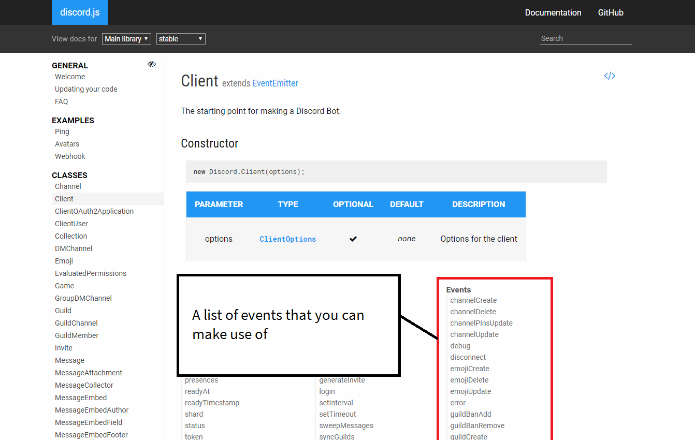
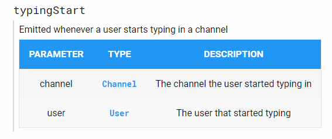

# Understanding Events

In the previous [chapter](first-bot.md), we looked at creating a very basic bot that replied "pong!" to
"ping!" messages. We also touched on the concept of _events_, which will be explained in this
chapter.

## What _is_ an event?

Discord.js fires an event whenever something happens. For example, an event is fired when a message is created, deleted
or edited. An event is fired whenever a channel is created, deleted or edited.

When you want your bot to react to an event, you can add an event handler (also referred to as an event listener).

> As a quick note, in this guide you may see "ES6" and wonder what we're referring to. JavaScript is
also known as ECMAScript, and ES6 is a version of it.
>
> You can find out more about arrow functions, referenced below, on the
[Mozilla Developer Network.](https://developer.mozilla.org/en/docs/Web/JavaScript/Reference/Functions/Arrow_functions)

```js
// Both of the following options do the same thing and can be interchanged


// 1) ES6 introduces shorter, optional arrow functions
client.on('message', message => {

});

// 2) Normal functions if you're not using ES6 or above
client.on('message', function(message) {
    
});
```

## What events can I use?

Discord.js offers _many, many_ more events than just "message". You can find a full
list in our [official documentation.](https://discord.js.org/#/docs/main/stable/class/Client)

<a href="https://discord.js.org/#/docs/main/stable/class/Client">
  
</a>

## Understanding the event documentation



Above is documentation for the _"typingStart"_ event. The description tells us that the event
is fired whenever a user starts typing in a channel.

The parameter table may be confusing to some. However, it just tells us the parameters that are
supplied to our event handler. The order of these parameters is important. Below is
an example event handler.

The "Type" column may also confuse you. This is the [class](https://developer.mozilla.org/en-US/docs/Web/JavaScript/Reference/Classes)
that the supplied parameter is an _instance_ of.
It means that the parameter is more than just a normal object, it also contains properties and functions
that you can use. For example, _Channel_ objects have the property `name` (i.e. `channel.name`) and you can also delete a channel
from discord using `channel.delete()`.

We'll talk more about classes in later chapters.

> As a quick note, in this guide you may see "ES6" and wonder what we're referring to. JavaScript is
also known as ECMAScript, and ES6 is a version of it. We recommend you use ES6 where available.
>
> You can find out more about arrow functions, referenced below, on the
[Mozilla Developer Network.](https://developer.mozilla.org/en/docs/Web/JavaScript/Reference/Functions/Arrow_functions)


```js
// Both of the following options do the same thing and can be interchanged


// 1) ES6 introduces shorter, optional arrow functions
client.on('typingStart', (channel, user) => {
  console.log(`${user.username} is typing in ${channel.name}`);
});

// 2) Normal functions if you're not using ES6 or above
client.on('typingStart', function(channel, user) {
  console.log(user.username + ' is typing in ' + channel.name);
});
```