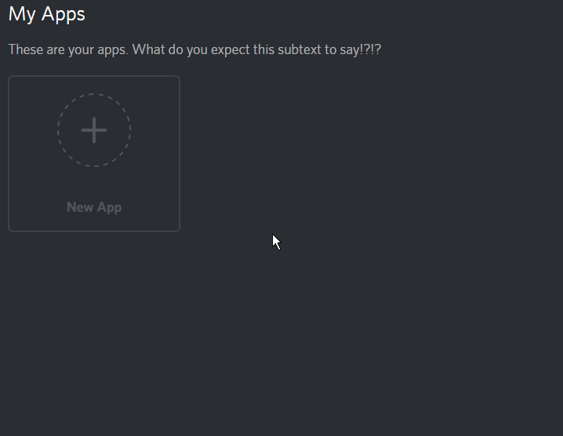
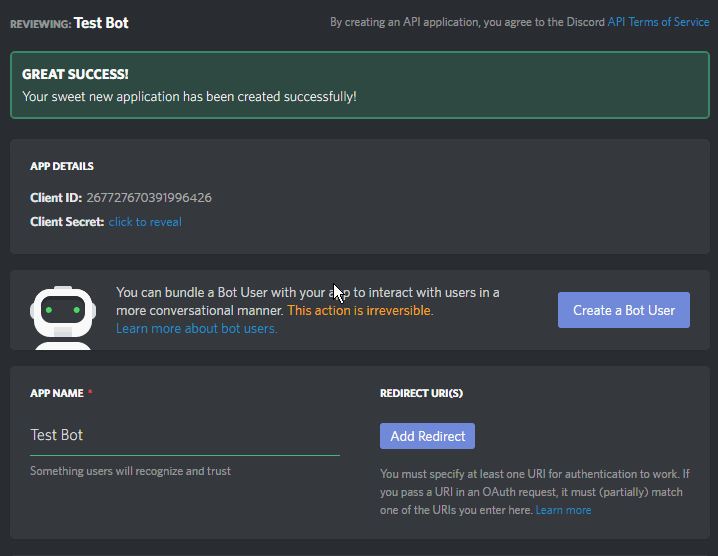

# Creating a Bot Account

Before you start using discord.js, you need to decide which type of bot you want to make.
You have the option to create a self-bot or a "real" bot.

## 1) Choosing a Bot

### Self Bots \(User Bots\)

A self-bot runs on _your_ account. This can be useful for creating custom commands for
yourself. A self-bot comes with multiple restrictions:

* Self-bots cannot respond to the messages of other users
* Self-bots cannot collect information about invites sent in chat channels - this is
known as _"invite scraping"_.
* Self-bots are subject to the same [Terms of Service](https://discordapp.com/tos) as any
other account.

Additionally, self bots cannot use some features of discord.js due to limitations set by
the [Discord API](https://discordapp.com/developers/docs/intro), e.g. bulk-deleting messages.

### "Real" Bots

Real bots are known as bot accounts. They are allowed to interact with other users and generally
have access to more features of discord.js and the [Discord API](https://discordapp.com/developers/docs/intro).
They are not allowed to scrape for invites and are subject to the same
[Terms of Service](https:\/\/discordapp.com/tos) as any other account.

Bot accounts should be used for any serious development of bots. They can be identified by
their _BOT_ badge next to the username:

## 2) Getting an Account Token

To have access to your bot account, you need access to its token. Both user and bot accounts have tokens.
You can think of your bot's token as its password, so you should _keep the token private_.

Once you have obtained an account token following the steps below, make sure you keep it safe. If other people get this
token, they have full access to your bot account. If you are using a self-bot, they have full access to your
user account.

### Tokens for Self Bots \(User Bots\)

1. Open the official Discord Client or the Web Application
2. Press `CTRL + SHIFT + I` \(or `⌘ + OPTION + I` on macOS\). The developer console should appear
(similar to the one in the gif below)
3. Click on the _Application_ tab
4. Under the _Storage_ section, expand _Local Storage_
5. Click on _https://discordapp.com_ under _Local Storage_
6. In the table that appears, find the value for `token` - copy this value

After following these steps, you should have copied your token.

In the gif, above the token that was copied
is `MjYxNjAyNDA3MzI1MjM3MjQ5.Cz3Yyg.k3UasL4Ay2QLTlV3D4jkvnrzA04` (don't worry, this token won't work 😛).

If there are any quotation marks at the start or end of this token, remove them. Keep this token safe and secure.

### Tokens for "Real" Bots:

#### Creating your Bot Application

An application on Discord can be used to create a bot, so you need to make an application first:

1. Login to the browser version of Discord
2. Go to the [Developer Applications](https://discordapp.com/developers/applications/me) section
3. Click _New App_
4. Give your application a name, e.g. Dice Bot
5. Give your application a description, e.g. Rolls a dice
6. If you want to, give your application an icon (this will be the avatar of the bot)
7. Click _Create App_

#### Getting the Application's Token

1. Click _Create a Bot User_ then _Yes, do it!_
2. Click _click to reveal_ next to the Token field
3. Copy the token that is present

You may also choose to uncheck the _Public Bot_ checkbox if you don't want your bot being added by
users other than yourself. You can modify this at any time.

## Next
After you have your bot token, take a look at how to [install discord.js](./installing-discordjs-windows.html)